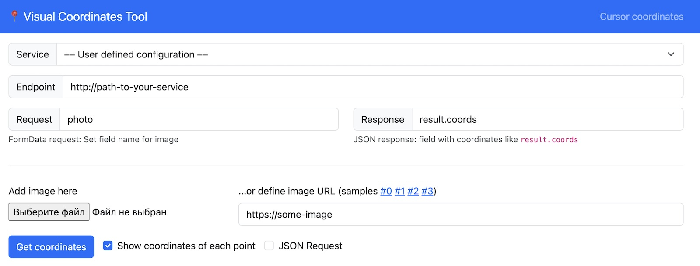
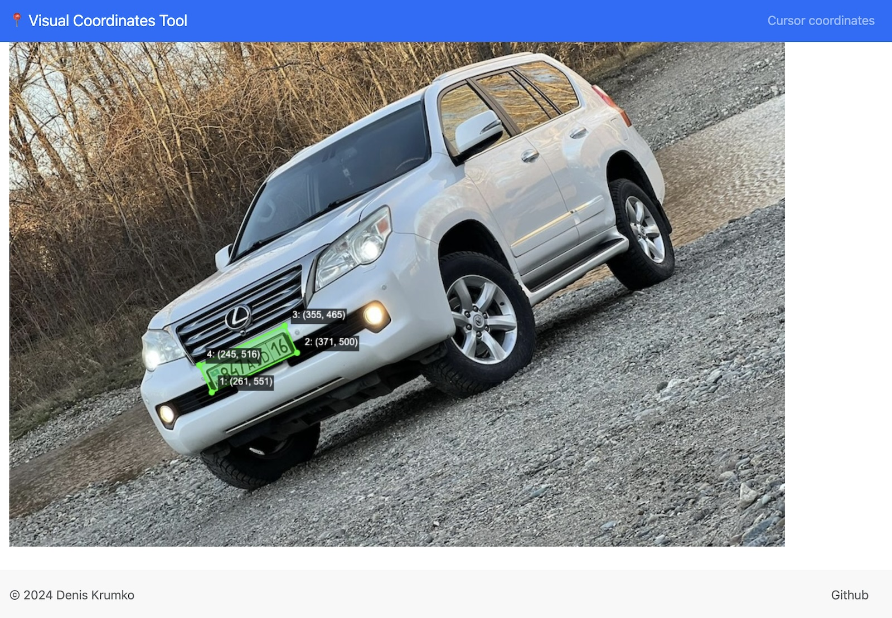

[](https://github.com/deniskrumko/visual-coordinates-tool/blob/master/go.mod)
[](https://github.com/deniskrumko/visual-coordinates-tool/actions)
[](https://hub.docker.com/r/deniskrumko/visual-coordinates-tool/tags)

Utility to visualize coordinates-detecting ML models results

# 🐳 Docker image

Checkout image on Docker Hub: https://hub.docker.com/r/deniskrumko/visual-coordinates-tool

```bash
docker pull deniskrumko/visual-coordinates-tool:latest
```

## How to run in docker

To run services with configuration - create `config` folder with `.toml` configuration file and mount it to `/usr/local/bin/config` (config example is bellow in README):
```bash
docker run --rm -v $(pwd)/config/:/usr/local/bin/config -p 8080:8080 \
    deniskrumko/visual-coordinates-tool:latest --config config/test.toml
```

To run services without configuration:
```bash
docker run --rm -p 8080:8080 deniskrumko/visual-coordinates-tool:latest
```

# ⚒️ How to use

## Define request parameters


## Get response with coordinates


## Request configuration

### JSON request

If your service accepts JSON requests with image URL then specify template using which request can be performed.
For example: `{"inputs": "%s"}`.

**NOTE**: `%s` is used to define where image URL will be passed.

Also you need to check **JSON Request** checkbox in near **Get coordinates** button.

### Form data request

If your service accepts form-data requests, then put field name in "Request" section.
For example: `photo`.

Also you need to uncheck **JSON Request** checkbox in near **Get coordinates** button.

## Response configuration

For example, you service responds with JSON like this:
```json
{
    "success": true,
    "data": {
        "coordinates": [
            {"x": 100, "y": 200},
            {"x": 200, "y": 300}
        ]
    }
}
```

Then you need to specify in **Response** section that field `data.coordinates` contains pairs of x-y coordinates.

**NOTE**: Currently visual-coordinates-tool supports only JSON responses and only pairs of `{"x": ..., "y": ...}` coordinates.

# ✅ Config example

```toml
[common]
# Name of the service to display in UI
name = "Cars Coordinates Testing"

# List of predefined service configurations to use
[services]

[services.my-service-1]
name = 'Service that uses JSON'
group = 'My services'
url = 'https://path-to-endpoint'
request_json_template = '{"inputs": "%s"}'
response_xy_field = 'coords'

[services.my-service-2]
name = 'Service that uses formdata'
group = 'My services'
url = 'http://path-to-endpoint'
request_formdata_field = 'photo'
response_xy_field = 'result.coords'
default = true

# List of image samples
[samples]
prefix = 'https://images-bucket-example.com/'
images = [
    'cars/1.jpg',
    'cars/2.jpg',
    'cars/3.jpg',
    'trucks/4.jpg',
    'trucks/5.jpg',
]
```

Service fields:
- `name` - service name
- `group` - group name
- `url` - path to endpoint
- `request_json_template` – predefined JSON request template
- `request_formdata_field` – predefined form-data request field
- `response_xy_field` – predefined response field with coordinates
- `default` – use this service by default or not
